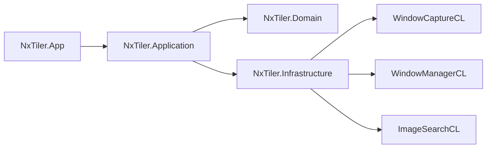

# Target Architecture

Last updated: 2026-02-13

## Architecture intent

Provide a modular platform for:

1. Instant and region snapshots.
2. WGC-based recording with mask support.
3. Vision analysis with phased YOLO rollout and fallback mode.
4. Overlay tracking with policy-based visibility and scaling.

## Layer responsibilities

1. `NxTiler.Domain`
Defines immutable contracts, settings, and business enums/records.
2. `NxTiler.Application`
Defines orchestration-facing interfaces and application services.
3. `NxTiler.Infrastructure`
Implements interfaces with Win32/WGC/FFmpeg/OpenCV/ONNX adapters.
4. `NxTiler.App`
ViewModels + pages + user workflow composition.

## New core contracts

1. `ICaptureService`
2. `ICaptureWorkflowService`
3. `IVideoRecordingEngine`
4. `IVisionEngine`
5. `IVisionWorkflowService`
6. `IOverlayTrackingService`

## Planned runtime flow

1. UI command/hotkey triggers workflow service.
2. Workflow service composes window manager + capture + recording/vision engines.
3. Engines emit domain-level results, not UI-specific types.
4. ViewModels map domain results to UI state and user feedback.

## Current implementation note

1. `ICaptureService` is currently backed by `NxTiler.Infrastructure.Capture.WgcCaptureService`.
2. `ICaptureWorkflowService` is currently backed by `NxTiler.App.Services.CaptureWorkflowService`.
3. Hotkey route for `HotkeyAction.InstantSnapshot` is wired in `WorkspaceOrchestrator`.
4. Region flow uses `NxTiler.App.Services.ISnapshotSelectionService` + `SnapshotSelectionWindow`.
5. `HotkeysSettings` includes dedicated capture bindings for instant and region snapshot actions.
6. Recording flow switches by `FeatureFlags.UseWgcRecordingEngine` between:
`NxTiler.Infrastructure.Recording.WgcVideoRecordingEngine` and legacy `FfmpegRecordingEngine`.
7. Migration safety policy: if WGC start fails at runtime, workflow immediately falls back to legacy path.
8. `IVisionWorkflowService` is backed by `NxTiler.App.Services.VisionWorkflowService`.
9. `IVisionEngine` currently has a template fallback implementation:
`NxTiler.Infrastructure.Vision.TemplateVisionEngine`.
10. Hotkey route for `HotkeyAction.ToggleVisionMode` is wired in `WorkspaceOrchestrator`.
11. `HotkeysSettings` includes `ToggleVision` binding for vision mode toggle.
12. `IVisionEngine` now also has `YoloVisionEngine` phase-1 slot for staged rollout.
13. Runtime policy: if YOLO engine fails and template fallback is enabled, workflow transparently retries with template engine.
14. `YoloVisionEngine` phase-2 implementation uses ONNX Runtime CPU baseline and is internally decomposed into session, preprocessing, parsing, and post-processing components.
15. `IOverlayTrackingService` is backed by `NxTiler.App.Services.OverlayTrackingService` and feeds `OverlayWindow` placement updates.
16. Overlay visibility policy evaluation uses `ICursorPositionProvider` (Win32 adapter in app runtime, deterministic provider in tests).
17. `OverlayWindow` applies proportional `ScaleTransform` from tracked state dimensions when `OverlayPolicies.ScaleWithWindow` is enabled.
18. `OverlayTrackingService` resolves overlay position by `OverlayAnchor` and clamps final geometry to monitor bounds.
19. Recording engines share FFmpeg process support primitives (`ProcessStderrTail`, `ProcessExitAwaiter`) to keep process/error/timeout behavior consistent.
20. `RecordingWorkflowService` relies on `RecordingWorkflowStateMachine` for explicit transition validation and state progression.
21. `DashboardViewModel` is now split into focused partial units (state, lifecycle, commands, snapshot projection) as completed `NX-062` decomposition.
22. Dashboard command orchestration now flows through dedicated services (`IDashboardWorkspaceCommandService`, `IDashboardRecordingCommandService`) to keep ViewModel focused on state projection and binding.
23. Dashboard busy/error execution policy now flows through `IDashboardCommandExecutionService`, reducing cross-cutting exception handling inside the ViewModel.

## Settings model expansion

`AppSettingsSnapshot` now includes:

1. `Capture`
2. `Vision`
3. `OverlayPolicies`
4. `FeatureFlags`

These sections define staged rollout and compatibility switches.
